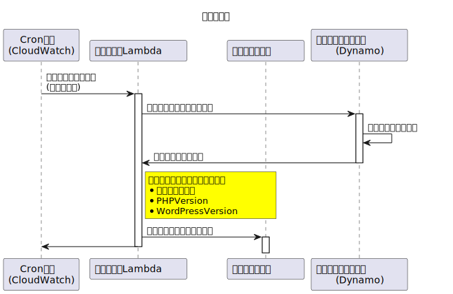
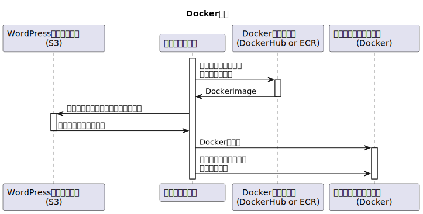
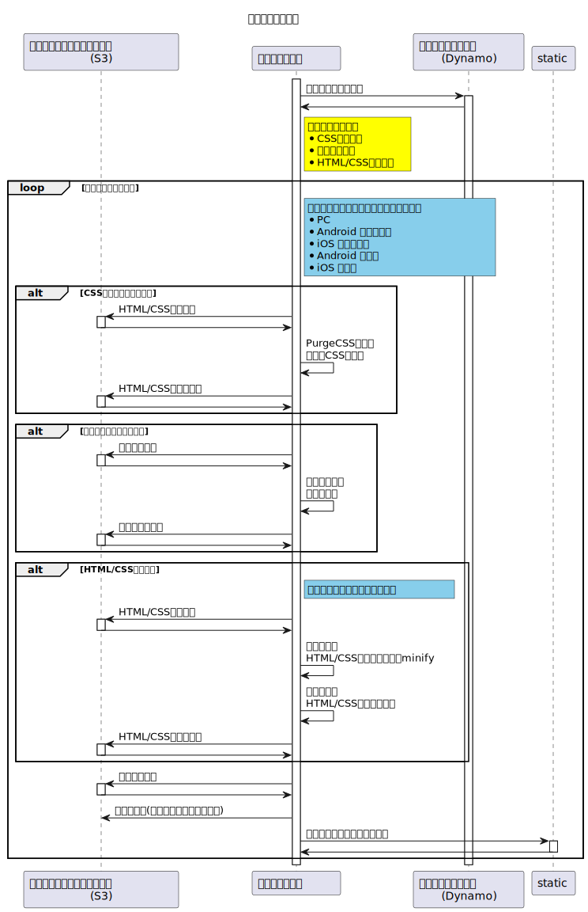
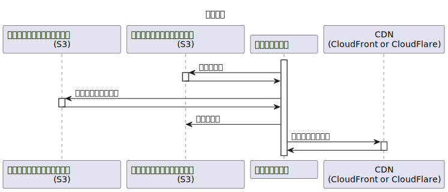

# ブログコンテンツ作成

## 概要

ブログコンテンツを作成するバッチのフロー。
１時間ごとに実行するべきジョブを選択（ユーザが設定した時間に起動）し、実際にＷＰサーバーを立ち上げて、そこに対してリクエストを行い、資材を取得する。  
資材取得後は資材の最適化を行い、できたものを実際に配布するものとして登録する。

## シーケンス

### ジョブ登録

### サイト起動（Docker 起動）

### コンテンツ取得

### コンテンツ最適化

### 本番適用

