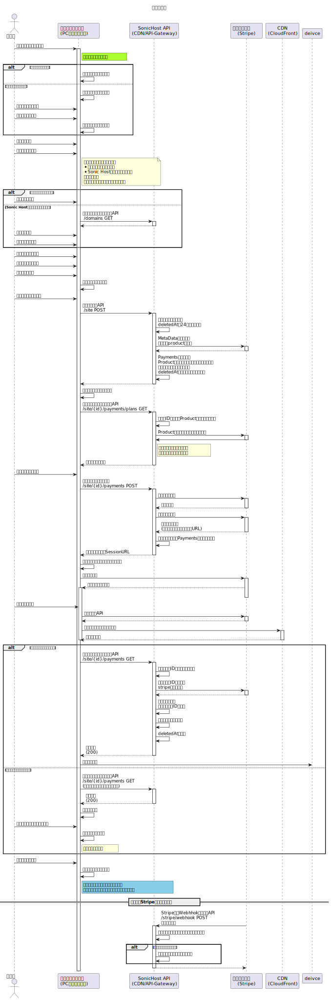

# サイト追加

## 概要

サイト追加するためのフロー。  
プランの選択やドメインの設定なども完了し、登録を行う。

Stripe との連携もあるため、きちんと連携できているかの確認が必要。
Stripe からの Webhook もあるため、一定期間内で

- webhook からの通知
- リダイレクトによる通知

の両方で成功通知が来たら成功とする方針がよさそう。
※　リダイレクトによる通知がない場合にはメールを送るなどの措置が必要。
※　 Checkout の Session の有効期限は発行されたらか９０分後とする。
※　仮登録のサイト情報は２４時間以内に支払いがないと削除される

## シーケンス

