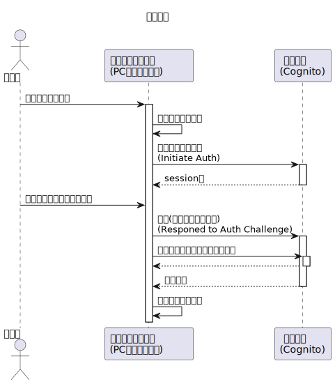
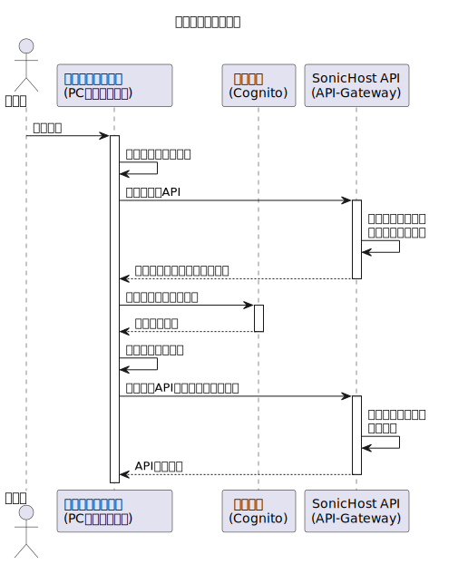

# システムアーキテクチャ

本資料は Sonic Host における全体のシステムアーキテクチャを定義する。  
API/クライアントアプリ/AWS 基盤とそれぞれ領域をまたがるような分野にフォーカスして定義を行うものとする。

## API のインターフェースの統一

本章では、API のインターフェースについて定義する。  
API のインターフェースを共通的に定義することにより、クライアントアプリの共通部品の処理でクライアント側の DB（React であれば Redux など）を自動で更新することができる。



### URI

URI についてはリソースの置き場所を定義する。
つまり、リソースと URI は 1:1 の関係になる。  
Git に登録されている 01_Sequences のフォルダ第一階層単位で分けて Resource を分ける。  
バックエンド側の Lambda についてもマイクロサービスの分割単位としてこの階層単位で作成する。



ルールとしては以下の通りである。

- 名詞で完結すること。getNotification のように動詞は入れない。
- ワード単位で/区切りを使用すること。siteDomain とする場合は site/domain のように管理すること。
- お知らせのようにリストで管理されているものは特定の項目を対象とする場合、パスパラメータを使用する。
  - ただし、ユーザ検索機能を利用した場合はクエリパラメータで表現する。

### メソッド

メソッドについては、URI で指定したリソースに対して、どのような操作を行うのかを定義する。  
英語でいうところの、目的語に対する動詞である。

種類としては以下のように定義する。
| メソッド | 操作内容　|
| ------- | --------- |
| GET | 取得 |
| POST | 追加 |
| PUT | 更新 |
| DELETE | 削除 |

上記のメソッドの種類によって、バックエンド側お呼び、クライアント側はリソースに対する処理の内容を動的に変更する。



### ボディパラメータ

ボディパラメータは、データの項目を定義する。  
そうすることによって、メソッドの種類と合わせてクライアントとバックエンドのデータの更新の同期を取っていくことができる。

#### リクエストパラメータ

クライアントアプリ ⇒ バックエンドへの通信をリクエストと定義する。  
よって、ユーザがバックエンドに対してどのようなリソース項目の取得・更新・削除をしたいという要求があったかを伝える。

##### GET

検索機能を利用した項目の検索の場合はクエリパラメータで指定する。

##### POST

POST の場合は以下のようにして指定する。

- どのような項目を追加したいか指定する場合は、data というパラメータに JSON 形式で指定する。
- 現在どのような値としてクライアントが認識しているか指定する場合は current というパラメータに JSON 形式で指定する。
  - POST で使用する場合は主にリスト管理されているデータの時に使用される。
- ID などの識別子を作成する場合は、バックエンド側で生成すためクライアント側では指定をしない。

##### PUT

PUT の場合は以下のようにして指定する。

- どのような項目を変更したいか指定する場合は、data というパラメータに JSON 形式で指定する。
- 現在どのような値としてクライアントが認識しているか指定する場合は、current というパラメータに指定する。
  - PUT の場合は data と必ず同じ項目をセットする必要あり。

##### DELETE

DELETE の場合は以下のようにして指定する。

- どのような項目を削除したいか指定する場合は、data というパラメータに JSON 形式で指定する。
  - DELETE の場合はレコードを特定するキーのみを入力する。
- 現在どのような値としてクライアントが認識しているかを指定する場合は、current というパラメータに指定する。
  - DELETE の場合は削除する想定のレコードを全部項目を入れる。

#### レスポンスパラメータ

リクエストの結果として帰ってきた通信(クライアント ⇐ バックエンド)をレスポンスとして定義する。  
よって、ユーザにバックエンド側でどのようなリソース項目の変更があったか・状態であるかを通知する。  
クライアント側では、レスポンスの結果に応じて Redux などのクライアント側のＤＢの情報を更新する。

##### 共通

ここでは、各メソッドにおいて共通となる項目について記載する。  
特にエラー時の応答についてはここで記載する。

レスポンスステータスについては以下のように定義する。
| ステータスコード | 定義 |
| --------------- | ---- |
| 200 | 成功 |
| 202 | 非同期処理の依頼成功 |
| 400 | バリデーションエラー・業務エラー |
| 403 | 認証エラー(トークン検証失敗) |
| 429 | 多重リクエストによる上限 |
| 500 | システムエラー |
| 503 | システムメンテナンス |

レスポンスボディについては以下のように扱う。

- クライアント側で表示してほしいメッセージ情報については message という JSON で通知する。
  - type で成功・失敗・モーダルなどの種類を通知
  - display で表示するメッセージ内容を通知
- サーバー側で発生したエラー除法については error という JSON で通知する。
  - type でバリデーションエラー・業務エラー・システムエラーを通知
  - detail でエラーの詳細内容を通知
    - バリデーションエラーの場合は Form の name をキー名に、エラー内容をバリュー値で指定
- リソースの状態については data という JSON で通知する。
  - GET であればリソース全部
  - POST であれば追加されたリソース
    - リスト形式の物は追加されたリソースが１つでも配列形式の JSON で通知する。
  - PUT であれば変更されたリソース
  - DELETE であれば削除されたリソース
- 非同期の処理が依頼された場合は、requestKey というキー名で取引ＩＤを通知
  - 非同期の結果照会された場合には、処理結果として data という JSON でリソース状態を通知
  - 非同期の結果照会された場合には、処理結果の種類として type という JSON で通知
    - リソースの情報 URI は uri というキー名で通知
    - 非同期の処理のメソッドについては method というキー名で通知

##### GET

GET の場合は以下のようにして指定する。

- バックエンド側のリソースの情報は data という JSON で通知する。
  - GET は対象リソースの全情報が返却される

##### POST

POST の場合は以下のように指定する。

- バックエンド側で追加された情報は data という JSON で通知する。
  - POST は追加された情報のみを通知する
  - リスト形式の物は追加されたリソースが１つであっても配列形式の JSON で通知する。

##### PUT

PUT の場合は以下のように指定する。

- バックエンド側で変更された情報は data という JSON で通知する。
  - PUT は変更されたリソースのみを通知する。
  - リストの場合、どのリソースかわかるように key というキー名で一意に特定する情報を通知する。

##### DELETE

DELETE の場合は以下のように指定する。

- バックエンド側で削除された情報は data という JSON で通知する。
  - DELETE は削除されたリソースのみを通知する
  - リストの場合、どのリソースか分かるように key というキー名で一意に特定する情報を通知する。

## 認証方式の統一

ここではどのように認証を扱うかを定義する。  
認証はクライアント・基盤・アプリ全てにつながる内容である。  
認証方式を統一することで、ユーザ情報の扱い方などが確定やクライアントアプリ・AWS 基盤の認証方式が確定できる。

### 認証方式

認証方式としては OIDC を使用する。

### シーケンス

OIDC として認証・認可によるトークン情報の発行とリフレッシュトークンによるトークン情報の更新がある。  
それぞれについて、以降で記載するシーケンスに従う形で実施する。

#### 認証認可フロー



#### リフレッシュトークンフロー



### 取り扱うデータ

ユーザに直接的にかかわる個人情報については認証基盤側で持つ方針とする。  
Sonic Host では取り扱う情報は少ないため、以下のようになる。

| データ種類     | 使用するタイミング |
| -------------- | ------------------ |
| メールアドレス | ログインするとき   |
| パスワード     | ログインするとき   |

## データ管理個所の確定

ここではどのようにしてデータを管理するかを定義する。  
データ管理個所の確定をすることで、データ情報を追加するときに、どこに追加すればよいか決められる。  
様々なデータが存在するが、ここではバックエンド側で保持しているリソースについてのみを記載する。

### ユーザ情報

ユーザについては認可サーバで発行された ID トークン(JWT)にて管理する。  
そのため、ユーザ ID は認可サーバにて自動的に発行されたＩＤをそのまま使用する。

sonic-host で使用する情報は以下のようになる。
| 物理名 | 論理名 | 用途 |
| ------ | ----- | ---- |
| sub | ユーザ識別子 | リソースとユーザの紐づけなど。|
| email | メールアドレス | ユーザ管理のため。 |

### サイト情報に関するリソース

サイト情報に関するリソースはバックエンド側で NoSQL で管理する想定。  
API の IF を通すことにより、リクエストからクライアントのリソース変更依頼とレスポンスのリソース変更結果をお互いに通知する。  
API の IF を通すことにより、バックエンド側の DB とクライアント側の DB の同期を取る。

#### ユニーク ID

リソースにユニーク ID を付与する場合は、バックエンド側で自動的に発番する。  
よって POST でリソースを新たに追加する場合にはクライアント側でユニーク ID を発番する必要はない。

### 決済情報

クレカや決済した情報などについては Stripe で管理する。  
Stripe は Saas 型の決済プラットフォームであり、基本的に決済のルールも Stripe に従うものとする。

## ログ処理方式の統一

ここではどのようにログを扱うかを定義する。  
全領域でログの出力方式を共通化することで Slack 通知する際にどのチャネルに出力するべきか、どのようなシステム処理を自動実行するべきかがハンドリングできるようになる。

ただし、API-GW のリクエスト・レスポンスログのように自動で出力されるログについては仕方ないものとする。

以下の図で「解析方法」で解析する際にフォーマットが統一されていることで、統一的な検知が可能になる。



### 出力形式

Sonic Host で出力するログの形式としては以下のようにする。  
また、Slack 通知できる量に限度があるため、極力無駄な情報は省くようにする省くようにする。

#### テンプレート

ログ出力のテンプレートは以下のようにする。

```json
{
  "startTime": "YYYY-MM-DDTHH:mm:ss.Z", // 開始時間。
  "level": "ERROR", // DEBUG INFO WARN ERROR のいずれか。これをもとに緊急性を変える。
  "functionName": "xxxx", // ログ出力が発生した関数名
  "fileName": "yyyyy", // ログ出力が発生したファイル名
  "lineNumber": "6", // ログ出力が発生したファイルの行
  "columnNumber": "10", // ログ出力が発生したファイルの列
  "userId": "zzzzz", // ユーザID。ユーザが認識できない状態のときはnullが入る。
  "trackId": "ooooo", // トランザクションID。クライアント側では設定不要。
  "messages": ["message"], // 出力メッセージ内容。配列形式で行替えを実現。
  "callStack": ["callstack"] // エラーが発生した時のコールスタック情報。
}
```

### トランザクション ID

バックエンド側でログを出力するときに使用するトランザクション ID についてはリバースプロキシで自動で採番される ID を使用する。  
Sonic Host においては AWS Api-Gateway で自動採番される ID を使用する。
