# システムアーキテクチャについて

ここではシステムアーキテクチャについて説明する。  
Sonic-Host では各領域の方式をシステムアーキテクチャという形で定義する。(全領域横断の場合は全体アーキテクチャと定義)。

## 目的

Sonic-Host はいくつかのシステム（領域）に分けることができる。  
それは以下の４つと考えられる。

- クライアントアプリ
- バックエンドアプリ
- バッチ処理
- AWS 基盤

ただし、それぞれシステムアーキ単体を考えるより、アーキを横断して共通化したほうが都合の良いアーキテクチャは存在する。  
そのため、本章では全体システムアーキを定義した後に、各システムアーキテクチャを定義する（思想を共通化する）。

## アーキテクチャ定義書の記載ルール

本章では、システムアーキテクチャ定義所を読みやすくするために、定義所記載のルールを統一化する。

- H1 タイトルはどの領域かを定義（クライアントアプリのシステムアーキテクチャ定義書など）
- H2 タイトルは記載するルールの目標を記載（API インターフェースを統一など）
  - H2 タイトルの説明には記載するルールの目的・効果を記載（API インターフェースを統一することにより、共通処理でデータ更新を可能するなど）
- H3 タイトル以降では実際に適用するルールを記載（使用する API メソッドの種類など）
